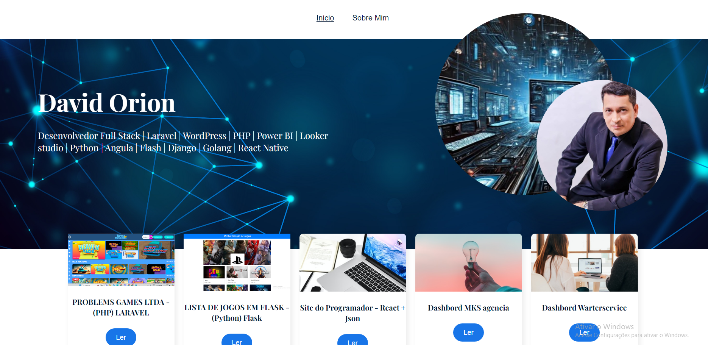
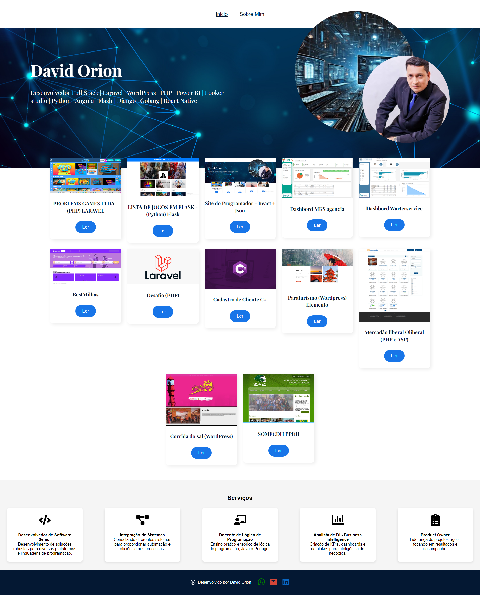
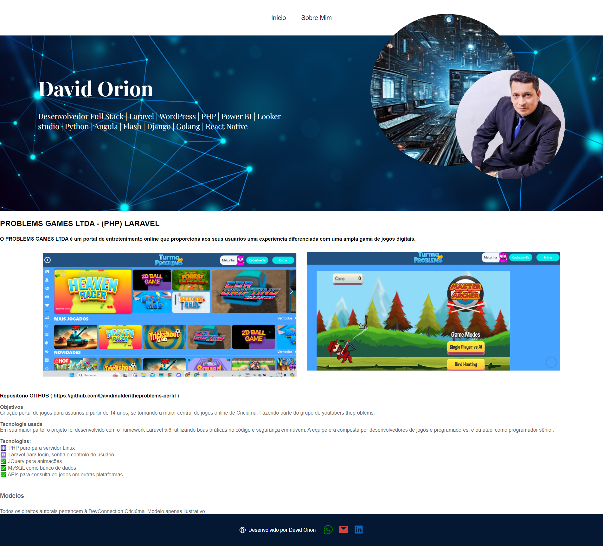
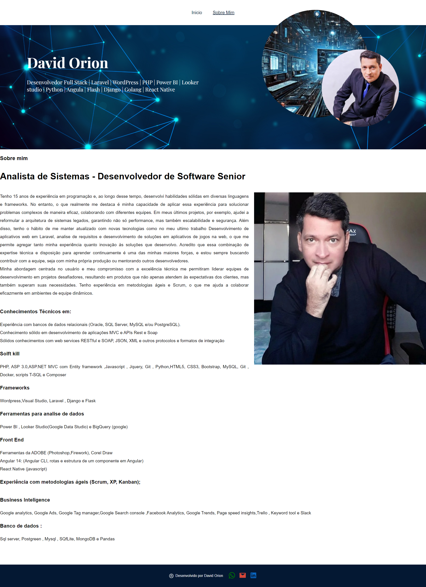

<h1 align="center">
<br>
  
<br>
<br>
Site  com  a Dinâmica no React + Json
</h1>

<p align="center">
Neste projeto, desenvolvi uma aplicação moderna e responsiva utilizando React, uma das bibliotecas JavaScript mais populares para construção de interfaces de usuário interativas. O objetivo deste projeto é apresentar uma experiência visual elegante, com destaque para a exibição gráfica de meus principais serviços profissionais, como Desenvolvedor de Software Sênior, Integração de Sistemas, Docente de Lógica de Programação, Analista de BI e Product Owner.</p>

<p align="center">
  <a href="#">
    
  </a>
</p>

<div align="center">

### Apresentação

<br>

### Home


  <br>

  ### Internas

  <br>

   ### Sobre MIM

  <br>
  
  <br> 

</div>

 
 ### Objetivos
```sh
 O design da interface gráfica foi cuidadosamente pensado para proporcionar uma navegação fluida e intuitiva, com ícones representativos para cada serviço, combinados com breves descrições. Utilizando componentes reutilizáveis, o código é modular e eficiente, garantindo escalabilidade e facilidade de manutenção. Cada ícone e serviço são renderizados dinamicamente a partir de dados armazenados em um arquivo JSON, aproveitando a capacidade do React de atualizar e manipular o DOM de maneira eficiente.

Além disso, a aplicação faz uso de bibliotecas modernas de ícones, como React Icons, para enriquecer a interface com representações visuais profissionais e esteticamente agradáveis. O layout é totalmente responsivo, garantindo que o conteúdo seja acessível e visualmente atraente tanto em dispositivos móveis quanto em telas maiores.

A escolha por React permitiu criar uma aplicação que não só entrega performance e rapidez, mas também proporciona uma experiência de usuário envolvente. Este projeto serve como uma vitrine para o uso de tecnologias de ponta no desenvolvimento de interfaces web, unindo eficiência e design gráfico sofisticado para atrair a atenção de recrutadores e clientes em potencial. 

```


<hr />

## Tecnologia usada

```sh
React Native 
Json
react-router-dom
react-icons
CSS
 
```

Usado do php puro, no servidor linux 

- ⚛️ **Javascript** — json
- ⚛️ **React native** — 
de usuario
- 💹 **JQuery** — Animações
- 💹 **JSON** — BD para conteudo


## Modelos

1. Todos os direito David orion:<br />
3. Modelo apenas ilustratorio<br />


